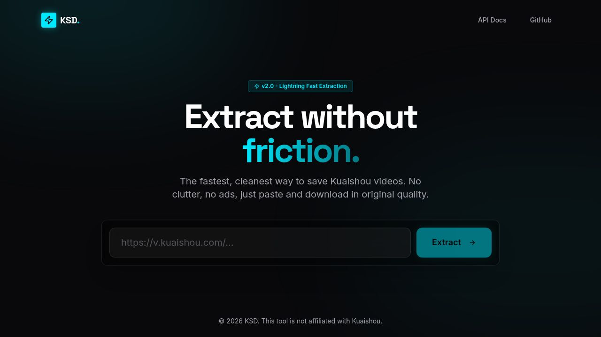

# KSD — Kuaishou & Kwai Video Downloader

A fast, clean web tool for extracting and downloading **Kuaishou** and **Kwai** short videos without watermarks and without any official API.



## Features

- Paste a Kuaishou or Kwai video URL and extract it instantly
- Video preview (streamed through proxy to avoid CORS)
- Download in original quality (no watermark)
- Full metadata: title, author, duration, quality badge (SD/HD/FHD)
- Blob-free direct streaming — downloads start immediately with native browser progress
- In-memory result cache (5 min TTL) — repeat URLs return instantly
- Rate limiting on all endpoints

## Supported URLs

| Platform | Domains |
|---|---|
| Kuaishou | `kuaishou.com`, `gifshow.com` |
| Kwai | `kwai.com`, `kwai.app`, `share.kwai.app`, `v.kwai.com`, `m.kwai.com` |

## Stack

- **Frontend**: React + Vite + TypeScript + Tailwind CSS + shadcn/ui
- **Backend**: Express 5 + TypeScript (esbuild bundle)
- **Monorepo**: pnpm workspaces
- **Scraping**: axios + cheerio, no headless browser required

## How It Works

The backend scrapes the video page using browser-like headers and extracts the video URL from structured data embedded in the page:

1. **JSON-LD VideoObject** (`<script type="application/ld+json">`) — primary method for Kwai; provides title, author, duration, thumbnail, resolution
2. **`__NUXT__` state** — JavaScript unicode-escaped URLs from Kwai's Nuxt SSR state
3. **`__APOLLO_STATE__`** — GraphQL cache for Kuaishou pages
4. **`og:video` meta tags** — universal fallback

Mobile and desktop requests fire **in parallel** so if one is slow the other picks up the result.

## Running Locally

```bash
# Install dependencies
pnpm install

# Start API server (port 8080)
pnpm --filter @workspace/api-server run dev

# Start frontend (any open port)
pnpm --filter @workspace/kuaishou-downloader run dev
```

## API

### `POST /api/download`

Extract video metadata from a URL.

**Request:**
```json
{ "url": "https://www.kwai.com/short-video/..." }
```

**Response:**
```json
{
  "status": "success",
  "title": "video caption",
  "author": "channel name",
  "thumbnail": "https://...",
  "video_url": "https://...",
  "quality": "HD",
  "duration": 8000,
  "cached": false
}
```

### `GET /api/proxy-video?url=<encoded>`

Streams the video through the proxy server (handles CDN Referer requirements and CORS). Used for both the in-page preview and the download button.

---

> This tool is not affiliated with Kuaishou or Kwai. For personal use only.
